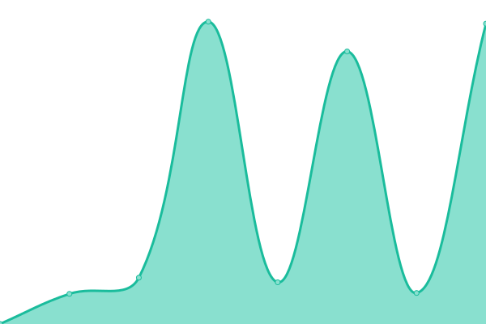
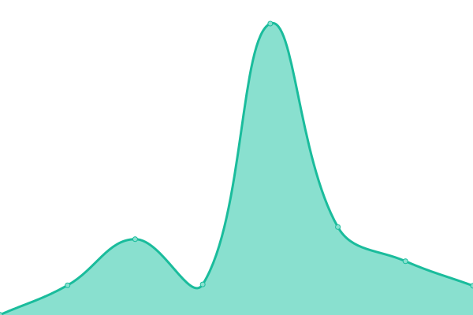
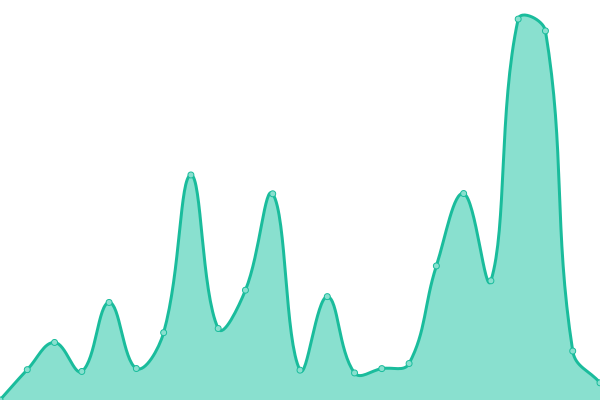

# [📈 Live Status](https://status.ambler.kr): <!--live status--> **🟧 Partial outage**

This repository contains the open-source uptime monitor and status page for [Ambler](https://ambler.kr), powered by [Upptime](https://github.com/upptime/upptime).

With [Upptime](https://upptime.js.org), you can get your own unlimited and free uptime monitor and status page, powered entirely by a GitHub repository. We use [Issues](https://github.com/amblerkr/upptime/issues) as incident reports, [Actions](https://github.com/amblerkr/upptime/actions) as uptime monitors, and [Pages](https://status.ambler.kr) for the status page.

<!--start: status pages-->
<!-- This summary is generated by Upptime (https://github.com/upptime/upptime) -->
<!-- Do not edit this manually, your changes will be overwritten -->
<!-- prettier-ignore -->
| URL | Status | History | Response Time | Uptime |
| --- | ------ | ------- | ------------- | ------ |
|  [ambler.kr](https://ambler.kr/) | 🟩 Up | [ambler-kr.yml](https://github.com/amblerkr/upptime/commits/HEAD/history/ambler-kr.yml) | 

 236ms
     
 | 

<a href="https://upptime.ambler.kr/history/ambler-kr">100.00%</a>
    

|  [link.ambler.kr](https://link.ambler.kr/) | 🟩 Up | [link-ambler-kr.yml](https://github.com/amblerkr/upptime/commits/HEAD/history/link-ambler-kr.yml) | 

 205ms
     
 | 

<a href="https://upptime.ambler.kr/history/link-ambler-kr">100.00%</a>
    

|  [notion.ambler.kr](https://notion.ambler.kr/) | 🟩 Up | [notion-ambler-kr.yml](https://github.com/amblerkr/upptime/commits/HEAD/history/notion-ambler-kr.yml) | 

 313ms
     
 | 

<a href="https://upptime.ambler.kr/history/notion-ambler-kr">100.00%</a>
    

|  [fruition.ambler.kr](https://fruition.ambler.kr/) | 🟩 Up | [fruition-ambler-kr.yml](https://github.com/amblerkr/upptime/commits/HEAD/history/fruition-ambler-kr.yml) | 

 335ms
     
 | 

<a href="https://upptime.ambler.kr/history/fruition-ambler-kr">100.00%</a>
    

|  [chatwoot.ambler.kr](https://chatwoot.ambler.kr/) | 🟥 Down | [chatwoot-ambler-kr.yml](https://github.com/amblerkr/upptime/commits/HEAD/history/chatwoot-ambler-kr.yml) | 

 184ms
     
 | 

<a href="https://upptime.ambler.kr/history/chatwoot-ambler-kr">0.00%</a>
    

|  [svg-to-png.ambler.kr](https://svg-to-png.ambler.kr/) | 🟩 Up | [svg-to-png-ambler-kr.yml](https://github.com/amblerkr/upptime/commits/HEAD/history/svg-to-png-ambler-kr.yml) | 

 193ms
     
 | 

<a href="https://upptime.ambler.kr/history/svg-to-png-ambler-kr">100.00%</a>
    

|  [rsshub.ambler.kr](https://rsshub.ambler.kr/) | 🟩 Up | [rsshub-ambler-kr.yml](https://github.com/amblerkr/upptime/commits/HEAD/history/rsshub-ambler-kr.yml) | 

 877ms
     
 | 

<a href="https://upptime.ambler.kr/history/rsshub-ambler-kr">100.00%</a>
    

|  [rssbox.ambler.kr](https://rssbox.ambler.kr/) | 🟩 Up | [rssbox-ambler-kr.yml](https://github.com/amblerkr/upptime/commits/HEAD/history/rssbox-ambler-kr.yml) | 

 176ms
     
 | 

<a href="https://upptime.ambler.kr/history/rssbox-ambler-kr">100.00%</a>
    

|  [rssbridge.ambler.kr](https://rssbridge.ambler.kr/) | 🟩 Up | [rssbridge-ambler-kr.yml](https://github.com/amblerkr/upptime/commits/HEAD/history/rssbridge-ambler-kr.yml) | 

 3107ms
     
 | 

<a href="https://upptime.ambler.kr/history/rssbridge-ambler-kr">99.86%</a>
    

|  [reddit-rss.ambler.kr](https://reddit-rss.ambler.kr/) | 🟩 Up | [reddit-rss-ambler-kr.yml](https://github.com/amblerkr/upptime/commits/HEAD/history/reddit-rss-ambler-kr.yml) | 

 1268ms
     
 | 

<a href="https://upptime.ambler.kr/history/reddit-rss-ambler-kr">100.00%</a>
    

|  [tiktokrss.ambler.kr](https://tiktokrss.ambler.kr/) | 🟥 Down | [tiktokrss-ambler-kr.yml](https://github.com/amblerkr/upptime/commits/HEAD/history/tiktokrss-ambler-kr.yml) | 

 0ms
     
 | 

<a href="https://upptime.ambler.kr/history/tiktokrss-ambler-kr">0.00%</a>
    

|  [monitorss.ambler.kr](https://monitorss.ambler.kr/) | 🟩 Up | [monitorss-ambler-kr.yml](https://github.com/amblerkr/upptime/commits/HEAD/history/monitorss-ambler-kr.yml) | 

 258ms
     
 | 

<a href="https://upptime.ambler.kr/history/monitorss-ambler-kr">100.00%</a>
    

|  [bluv.ambler.kr](https://bluv.ambler.kr/) | 🟥 Down | [bluv-ambler-kr.yml](https://github.com/amblerkr/upptime/commits/HEAD/history/bluv-ambler-kr.yml) | 

 150ms
     
 | 

<a href="https://upptime.ambler.kr/history/bluv-ambler-kr">0.00%</a>
    

<!--end: status pages-->

[**Visit our status website →**](https://status.ambler.kr)

## 📄 License

- Code: [MIT](./LICENSE) © [Ambler](https://ambler.kr)
- Data in the `./history` directory: [Open Database License](https://opendatacommons.org/licenses/odbl/1-0/)
