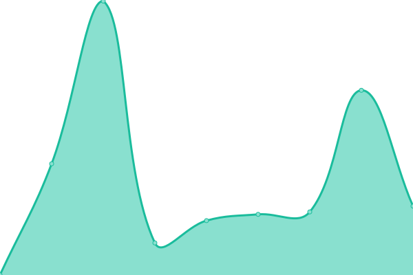

# [📈 Live Status](https://status.ambler.kr): <!--live status--> **🟩 All systems operational**

This repository contains the open-source uptime monitor and status page for [Ambler](https://ambler.kr), powered by [Upptime](https://github.com/upptime/upptime).

With [Upptime](https://upptime.js.org), you can get your own unlimited and free uptime monitor and status page, powered entirely by a GitHub repository. We use [Issues](https://github.com/amblerkr/upptime/issues) as incident reports, [Actions](https://github.com/amblerkr/upptime/actions) as uptime monitors, and [Pages](https://status.ambler.kr) for the status page.

<!--start: status pages-->
<!-- This summary is generated by Upptime (https://github.com/upptime/upptime) -->
<!-- Do not edit this manually, your changes will be overwritten -->
<!-- prettier-ignore -->
| URL | Status | History | Response Time | Uptime |
| --- | ------ | ------- | ------------- | ------ |
|  [ambler.kr](https://ambler.kr/) | 🟩 Up | [ambler-kr.yml](https://github.com/amblerkr/upptime/commits/master/history/ambler-kr.yml) | 

 1506ms
     
 | 

<a href="https://status.ambler.kr/history/ambler-kr">100.00%</a>
    

|  [notion.ambler.kr](https://notion.ambler.kr/) | 🟩 Up | [notion-ambler-kr.yml](https://github.com/amblerkr/upptime/commits/master/history/notion-ambler-kr.yml) | 

 1504ms
     
 | 

<a href="https://status.ambler.kr/history/notion-ambler-kr">100.00%</a>
    

|  [frution.ambler.kr](https://fruition.ambler.kr/) | 🟩 Up | [frution-ambler-kr.yml](https://github.com/amblerkr/upptime/commits/master/history/frution-ambler-kr.yml) | 

 634ms
     
 | 

<a href="https://status.ambler.kr/history/frution-ambler-kr">100.00%</a>
    

|  [parkjuhyun.kr](https://parkjuhyun.kr/) | 🟩 Up | [parkjuhyun-kr.yml](https://github.com/amblerkr/upptime/commits/master/history/parkjuhyun-kr.yml) | 

 464ms
     
 | 

<a href="https://status.ambler.kr/history/parkjuhyun-kr">100.00%</a>
    

<!--end: status pages-->

[**Visit our status website →**](https://status.ambler.kr)

## 📄 License

- Code: [MIT](./LICENSE) © [Ambler](https://ambler.kr)
- Data in the `./history` directory: [Open Database License](https://opendatacommons.org/licenses/odbl/1-0/)
